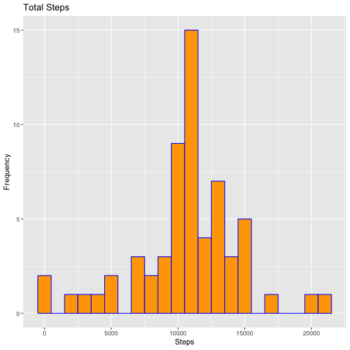

---
---
title: "Reproducible Research: Peer Assessment 1"
author: "Siobhan O Connor"
date: "4/16/2019"
output: 
  html_document:
  keep_md: true


---
### Executing with cmd - knit("PA1_template.Rmd","PA1_template.md")
### Loading and preprocessing the data
#### Question 1 Code to read in and process data 
#### Load Packages, Load Data, Check for NAs, output Stat Summary and begin Exploring the Data 


```r
knitr::opts_chunk$set(echo = TRUE)


library(lubridate)
library(dplyr)
library(ggplot2)


data <- read.csv("RawData/activity.csv")

data$date <- as.Date(data$date)

test <- sum(is.na(data))

msg <- paste("There are NAs present in data : " ,test , " NA occurences")
print(msg)
```

```
## [1] "There are NAs present in data :  2304  NA occurences"
```

```r
stats_summary <- summary(data)  

print(stats_summary)
```

```
##      steps             date               interval     
##  Min.   :  0.00   Min.   :2012-10-01   Min.   :   0.0  
##  1st Qu.:  0.00   1st Qu.:2012-10-16   1st Qu.: 588.8  
##  Median :  0.00   Median :2012-10-31   Median :1177.5  
##  Mean   : 37.38   Mean   :2012-10-31   Mean   :1177.5  
##  3rd Qu.: 12.00   3rd Qu.:2012-11-15   3rd Qu.:1766.2  
##  Max.   :806.00   Max.   :2012-11-30   Max.   :2355.0  
##  NA's   :2304
```

### What is mean total number of steps taken per day?
#### Question 2 - Histogram of Total number of Steps taken each day


```r
total_steps_by_date <-  data %>%
                group_by(date) %>%
                summarise(steps = sum(steps,na.rm=TRUE))

mean_of_total_steps <- round(mean(total_steps_by_date$steps))


msg <- paste("The mean total number of steps is ", mean_of_total_steps)

print(msg)
```

```
## [1] "The mean total number of steps is  9354"
```

```r
## 1. Histogram of Total number of Steps taken each day

ggplot(data=total_steps_by_date,aes(date,steps)) +
  geom_bar(stat="summary",fun.y="sum",fill="red",col="black")+
  geom_hline(yintercept=mean_of_total_steps,col="yellow")+
  ggtitle("Total Number of Steps taken each Day")+
  labs(x="Date",y="Number of Steps")
```


#### Question 3 - Calculate Mean and Median Number of Steps by Date


```r
mean_steps_by_date <-   data %>%
                        group_by(date) %>%
                        summarise(steps = mean(steps,na.rm=TRUE))

print(mean_steps_by_date)
```

```
## # A tibble: 61 x 2
##    date         steps
##    <date>       <dbl>
##  1 2012-10-01 NaN    
##  2 2012-10-02   0.438
##  3 2012-10-03  39.4  
##  4 2012-10-04  42.1  
##  5 2012-10-05  46.2  
##  6 2012-10-06  53.5  
##  7 2012-10-07  38.2  
##  8 2012-10-08 NaN    
##  9 2012-10-09  44.5  
## 10 2012-10-10  34.4  
## # … with 51 more rows
```

```r
## ?? Should Median be calculated to exclude the zero step observations and missing values ie steps[steps>0]
## median as currently calculated = zero because so many observations = 0

median_steps_by_date <- data %>%
                        group_by(date) %>%
                        summarise(steps = median(steps,na.rm=TRUE))
```

### What is the average daily activity pattern?
#### Exploratory Graphs Question 4
#### Time series Plot of Average Steps Per Day with mean for all days added as yellow line 


```r
ggplot(data=mean_steps_by_date,aes(date,steps),na.rm=TRUE) +
  geom_line(col="blue",size = 1.5 )+
  geom_hline(yintercept=mean(mean_steps_by_date$steps,na.rm=TRUE),size=2,col="yellow")+
  ggtitle("Average Number of Steps taken each Day")
```

```
## Warning: Removed 2 rows containing missing values (geom_path).
```


#### Question 5 Analyze avg # steps by time interval
#### Which is 5-minute interval that, on average, contains the maximum number of steps ?


```r
mean_steps_by_interval <-   data %>%
    group_by(interval) %>%
    summarise(steps = mean(steps,na.rm=TRUE))

m_max <- max(mean_steps_by_interval$steps)

avg_steps_across_all_intervals <- mean(mean_steps_by_interval$steps)

interval_with_max_avg_steps <- subset(mean_steps_by_interval,steps==m_max)

interval_answer <- interval_with_max_avg_steps$interval
max_steps_interval <- round(interval_with_max_avg_steps$steps,2)

msg <- paste("Interval",interval_answer,"has the maximum # of Steps = ", max_steps_interval)

print(msg)
```

```
## [1] "Interval 835 has the maximum # of Steps =  206.17"
```

```r
### rename columns to differentiate them in merge
names(mean_steps_by_interval) <- c("m_interval","m_steps")


## Plot Avg Steps and identify max steps and related interval  

ggplot(data=mean_steps_by_interval,aes(x=m_interval,y=m_steps)) +
  geom_col(col="blue")+
  geom_hline(yintercept=avg_steps_across_all_intervals,na.rm=TRUE,col="yellow")+
  ggtitle("Maximum of Average # of Steps for each time interval")+
  labs(x="Time Interval",y="Max # Steps")+
  annotate("text",x=1500,y=180,label="Max Average # Steps",col="red",cex=2.5)+
  annotate("text",x=1500,y=170,label=max_steps_interval,col="red")+
  annotate("text",x=1510,y=150,label="observed during interval",col="red",cex=2.5)+
  annotate("text",x=1510,y=140,label=interval_answer,col="red")
```


#### Ques 7
#### Code to describe and show a strategy for imputing missing data
##### Strategy : impute based on mean_steps_by_interval

#### Coding approach : Merge the calculated mean of steps for an interval with the orginal data
#### Replace the values for steps that are currently NAs with the calculated mean for steps observed within that interval  


```r
data_na_steps_replaced <- merge(data,mean_steps_by_interval,by.x="interval",by.y="m_interval")

data_na_steps_replaced$steps[is.na(data_na_steps_replaced$steps)] <- data_na_steps_replaced$m_steps[is.na(data_na_steps_replaced$steps)]


## Histogram of the total number of steps taken each day after missing values are imputed

total_steps_no_na_by_date <-  data_na_steps_replaced %>%
  group_by(date) %>%
  summarise(steps = sum(steps,na.rm=TRUE))


ggplot(data=total_steps_no_na_by_date,aes(date,steps)) +
  geom_bar(stat="summary",fun.y="sum",fill="purple",col="black")+
  ggtitle("Total # Steps taken each Day(NAs imputed)")+
  labs(x="Date",y="Number of Steps")
```



#### Ques 8 
#### Panel plot comparing the average number of steps taken per 5-minute interval across weekdays and weekends


```r
data8 <- data_na_steps_replaced


data8$day_weekday <- weekdays(data8$date) 

data8$weekend_indicator <- ifelse(wday(data8$date) %in% c(1,7),"WE","WD")


mean_steps_by_interval_by_weekend_indicator <-   data8 %>%
  group_by(interval,weekend_indicator) %>%
  summarise(steps = mean(steps,na.rm=TRUE))


par(mfrow = c(2,1), mar=c(4,4,2,1))


with(subset(mean_steps_by_interval_by_weekend_indicator,weekend_indicator=="WE"), 
     plot(interval,steps,type="l",main="Avg # Steps Weekend Day ",col="purple"))
     
with(subset(mean_steps_by_interval_by_weekend_indicator,weekend_indicator=="WD"), 
          plot(interval,steps,type="l",main="Avg # Steps Weekday ",col="red") )    
```


